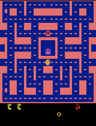
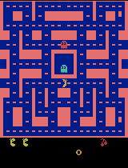
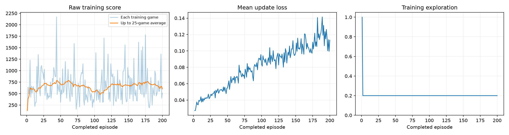

# Ms. Pac-Man DQN — Class 3 experiment

I used the [class's supplied notebook](https://github.com/pepealonso95/pacman-dqn) to train a Ms. Pac-Man agent. The best completed run scored **750 points on average** across the five fixed evaluation games, compared with **492** for the untrained network. This is the best of three experiments reported below, and its lead over my first trained run is only **16 points**. Five games are too few to claim a reliable improvement.

## Choices and predictions

| Training setting | Main run | Why |
| --- | ---: | --- |
| Exploration | 0.20 | After the random warm-up, about one in five training moves tries a random route. |
| Episodes (training games) | 200 | A 100-game run improved on the untrained agent, but was uneven; I tested whether more practice helped. |
| Learning rate | 0.00005 | A 200-game run at 0.0001 scored worse, so I tested whether smaller learning updates helped. |

Before the first run I predicted a possible mean-score gain but unreliable play. Before the 200-game run I predicted that more practice *might* improve the mean; it did not. Before lowering the learning rate I predicted possible steadier updates, while noting that learning could become too slow. These predictions were recorded [before the 200-game run](experiments/200-game-prediction.md) and [before the lower-rate run](experiments/200-game-low-rate-prediction.md).

## Results from all three runs

Every run started from a fresh untrained network. The baseline was the **untrained network**, not an agent choosing random actions every time. All runs used training exploration 0.20 and the same five evaluation seeds, 5% evaluation exploration, and 3,000-decision limit. No evaluation game reached the limit.

| Run | Games | Learning rate | Five trained scores | Mean | Evidence |
| --- | ---: | ---: | --- | ---: | --- |
| First | 100 | 0.0001 | 860, 450, 780, 780, 800 | **734** | [Executed notebook](experiments/100-games/pacman_dqn.ipynb) · [Comparison](experiments/100-games/results/comparison.json) |
| More practice | 200 | 0.0001 | 720, 480, 660, 820, 320 | **600** | [Executed notebook](experiments/200-games-standard/pacman_dqn.ipynb) · [Comparison](experiments/200-games-standard/results/comparison.json) |
| Smaller updates (**main result**) | 200 | 0.00005 | 600, 640, 720, 1410, 380 | **750** | [Executed notebook](pacman_dqn.ipynb) · [Comparison](results/comparison.json) |

The main run's complete five-game comparison:

| Evaluation game (seed) | Before training | After training |
| --- | ---: | ---: |
| 1 (101) | 350 | 600 |
| 2 (202) | 500 | 640 |
| 3 (303) | 320 | 720 |
| 4 (404) | 800 | 1410 |
| 5 (505) | 490 | 380 |
| **Mean** | **492** | **750** |

The main run improved the mean by **258 points** over its untrained baseline. Four of its five scores improved; one fell. Compared with the first trained run, its mean was only **16 points higher**, largely because game 4 scored 1410. The training loss still rose during this run, so the prediction that smaller updates would make learning visibly steadier was **not supported by that plot**. Trying settings on the same five games can also favor a lucky result; these scores are a class comparison, not a fresh test on unseen games.

The main run finished **200/200 training games**, **120,695 decisions**, and **29,924 learning updates** in **696 seconds (11 minutes 36 seconds)**, including periodic demonstrations. Hardware: **Apple M5 Mac, MPS GPU**, Python 3.13.15, and PyTorch 2.14.0. [Full settings and versions](results/config.json) · [Per-game training log](results/training.csv) · [Run summary](results/training_summary.json)

## Gameplay and training evidence

Each GIF is only the first **up to 20 seconds** of one game, played back faster. The final GIF was chosen from the highest-scoring of the five final games. The full-game scores above are better evidence than a short or best-selected clip.

| Before training | Best trained demonstration |
| --- | --- |
|  |  |

Progress clips from the 200-game main run:

| 25 games | 50 games | 75 games | 100 games |
| --- | --- | --- | --- |
|  |  |  |  |
| 125 games | 150 games | 175 games | 200 games |
|  |  |  |  |

## What the agent learns

An **observation** is four recent, small grayscale game screens, helping the agent see movement. An **action** is a joystick move. The game gives **reward** from points earned. The network uses remembered screens, moves, and rewards to update its estimate of which move could earn more future points. During training, individual rewards are clipped to −1 through +1; the evaluation scores above are actual game points.

**Limitation:** Scores vary sharply across games and settings. The main run's training scores also rose and fell, and its fifth evaluation game was worse than before training. A 16-point lead across just five games could be chance.

**Next experiment (not run):** Lower only training exploration from 0.20 to **0.10**, keeping 200 games, learning rate 0.00005, and evaluation settings fixed. This tests whether fewer random training moves help, though it might reduce discovery of new routes.

## Open, reproduce, and find the full results

Open the **[main executed notebook](pacman_dqn.ipynb)** on GitHub to see its saved settings, final scores, plot, and gameplay stills. The animated GIFs are above. To rerun locally, use Python 3.11–3.13 and Jupyter, keep [`pacman_player.py`](pacman_player.py) beside the notebook, install [`requirements.txt`](requirements.txt), and run cells from top to bottom. Each run creates a new folder and ZIP under `pacman_runs/`; results may vary on a different run or computer.

The complete ZIPs, including the untrained, intermediate, and final `.pt` model checkpoints, are kept **locally** and excluded from GitHub:

| Run | Local ZIP |
| --- | --- |
| 100 games | `pacman_runs/20260914_130002_885760.zip` |
| 200 games, rate 0.0001 | `pacman_runs/20260914_134909_126423.zip` |
| 200 games, rate 0.00005 (**main**) | `pacman_runs/20260914_135753_663570.zip` |
